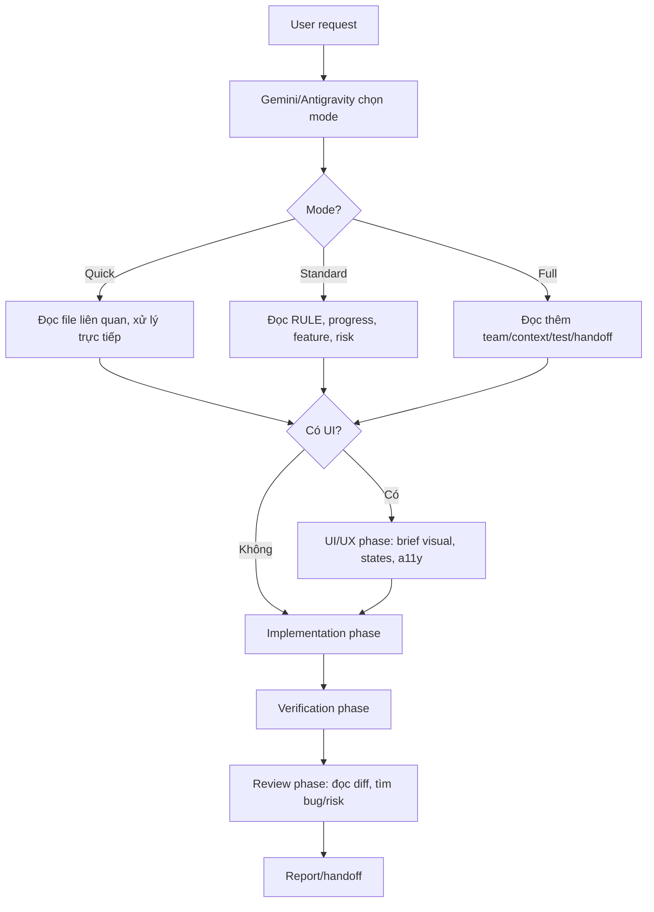

# Gemini / Antigravity Solo Workflow

Dùng file này khi chạy độc lập bằng Gemini CLI hoặc Antigravity CLI. Mục tiêu là giữ được
kỷ luật H5S và chạy độc lập hoàn hảo.

## 1. Luồng Làm Việc



## 2. Role Switching

Gemini/Antigravity solo có thể đóng nhiều vai, nhưng phải theo phase:

1. **Leader:** hiểu yêu cầu, chọn mode, chọn model tier theo [MODEL_ROUTER.md](MODEL_ROUTER.md), lập plan và tạo `H5S/specs/<feature-id>/` nếu là Standard/Full.
2. **UI/UX:** bắt buộc cho UI lớn; tạo brief trước khi code.
3. **Coder:** claim active writer, chạy `h5s_guard.py preflight`, sửa file trong scope.
4. **Tester:** chạy verify, cập nhật `test-evidence.md`.
5. **Reviewer:** đọc diff và finding như một lần review riêng.
6. **Leader:** chạy `h5s_guard.py verify`, tổng hợp kết quả.

Antigravity/Gemini nên tận dụng điểm mạnh UI/UX:
- visual hierarchy,
- responsive desktop/mobile,
- interaction states,
- loading/empty/error states,
- accessibility.

## 3. Prompt Mẫu

### Feature vừa

```text
harness

Bạn là Gemini/Antigravity solo trong H5S.
Chọn Standard mode. Đọc H5S/RULE.md, H5S/progress.md,
H5S/feature_list.json, H5S/docs/FEATURE_INTAKE.md và
H5S/docs/SPEC_WORKFLOW.md, H5S/docs/GEMINI_SOLO_WORKFLOW.md,
H5S/docs/MODEL_ROUTER.md.
Tự chọn model tier theo task.
Tạo H5S/specs/<feature-id>/ nếu Standard/Full, rồi chạy h5s_guard preflight
trước khi sửa file.
Làm theo phase: Leader -> UI/UX nếu có -> Coder -> Tester -> Reviewer.
```

### UI/UX trước khi code

```text
harness

Task này có UI. Hãy chạy UI/UX phase trước:
- tạo design direction,
- liệt kê state desktop/mobile/loading/empty/error,
- ghi accessibility notes,
- nếu là cinematic landing page, đọc H5S/docs/UI_PRESETS/CINEMATIC_LANDING_BUILDER.md,
- sau đó mới hỏi/đề xuất bước implement.
```

### Feature lớn

```text
harness full

Bạn là Gemini/Antigravity solo trong H5S Full mode.
Tách task thành phase nhỏ. Ghi tiến độ vào H5S/progress.md.
Ghi scope/task/evidence vào H5S/specs/<feature-id>/.
Nếu context dài, cập nhật H5S/docs/session-handoff.md trước khi dừng.
```

## 4. MCP/Tool Gợi Ý

- Context7: docs đúng version.
- Serena: code intelligence trong repo lớn.
- Playwright MCP: UI QA khi có dev server.
- agentmemory: dự án dài nhiều phiên.
- Ponytail: giữ code nhỏ, tránh over-engineering.

Không bật tool nếu task không cần.

## 5. Guard Commands

*Lưu ý: Luôn tìm vị trí thực tế của file `h5s_guard.py` trong workspace hiện tại trước khi chạy (ví dụ `python "gemini/H5S/scripts/h5s_guard.py"` nếu đang ở thư mục cha).*

```bash
python H5S/scripts/h5s_guard.py preflight --mode standard --feature <feature-id>
python H5S/scripts/h5s_guard.py verify --mode standard --feature <feature-id>
```

---

## 6. Tích hợp Antigravity IDE (Nếu dùng Antigravity IDE)

Khi chạy độc lập trên Antigravity IDE, hãy tuân thủ tích hợp sau:
1. **Lập kế hoạch (Planning Mode):**
   * Sử dụng tính năng lập kế hoạch tích hợp sẵn của IDE (`implementation_plan.md` và `task.md` trong thư mục brain). Đây là nguồn thông tin gốc (Source of Truth) cho tương tác với người dùng.
   * Sau khi người dùng phê duyệt kế hoạch, tự động sao chép/đồng bộ nội dung từ `implementation_plan.md` vào file spec của dự án `H5S/specs/<feature-id>/spec.md` và đồng bộ checklist `task.md` vào `H5S/progress.md` để đảm bảo lưu trữ lịch sử trong dự án.
2. **Thao tác File:**
   * Thay vì chạy các lệnh terminal thô (`cat`, `grep`, `ls`, `sed`), hãy ưu tiên các công cụ IDE chuyên dụng (`view_file`, `grep_search`, `list_dir`, `replace_file_content`, `multi_replace_file_content`).
3. **Cấm chạy `cd`:**
   * Tuyệt đối không chạy lệnh `cd` qua tool chạy lệnh terminal (`run_command`), hãy sử dụng tham số `Cwd` trực tiếp của tool.
4. **Báo cáo kết quả:**
   * Khi hoàn thành tác vụ, hãy điền đầy đủ kết quả vào file `walkthrough.md` theo yêu cầu của IDE, rồi đồng bộ sang `H5S/specs/<feature-id>/test-evidence.md`.
