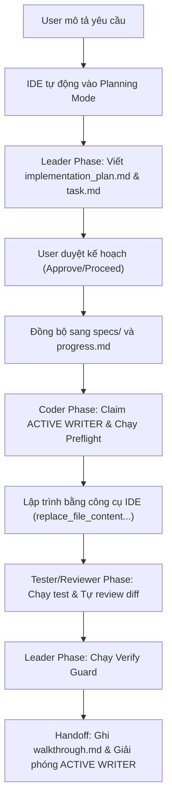

# H5S Solo Workflow Playbook: Antigravity IDE

Tài liệu này là bản hướng dẫn thực chiến khi copy template `gemini` vào một dự án mới để chạy độc lập trên **Antigravity IDE**. Quy trình này hoàn toàn không liên quan đến Codex và được thiết kế tối ưu cho một Agent duy nhất (Antigravity/Gemini) vận hành trực tiếp.

---

## 1. Luồng Vận Hành Độc Lập

Mô hình hoạt động của Solo Agent trên Antigravity IDE trải qua các pha khép kín để đảm bảo tính kỷ luật và an toàn cho mã nguồn:

### Nguyên tắc cốt lõi:
- **Tập trung vào IDE:** Sử dụng tính năng lập kế hoạch tương tác (`implementation_plan.md`, `task.md`) của IDE làm trung tâm điều phối.
- **Kỷ luật Harness:** Bắt buộc đồng bộ kế hoạch sang thư mục dự án (`H5S/specs/` và `H5S/progress.md`) và chạy guard script trước/sau khi code.
- **Tiết kiệm Token:** Chỉ đọc các file cần thiết theo phân loại Mode (Quick, Standard, Full) và ưu tiên sử dụng công cụ đọc/sửa file cục bộ của IDE.

---

## 2. Các Mode Vận Hành Tiết Kiệm Token

H5S tối ưu hóa token bằng cách chọn chế độ (mode) trước khi đọc tài liệu. Agent không đọc toàn bộ thư mục `H5S/` cho các yêu cầu nhỏ.

| Mode | Trigger từ User | File Agent nên đọc | File không cần đọc ngay |
| :--- | :--- | :--- | :--- |
| **Quick** | Tác vụ nhỏ, hỏi đáp nhanh, sửa typo, sửa 1 file nhỏ. | `GEMINI.md`, các file liên quan trực tiếp. | Toàn bộ thư mục `H5S/docs/`. |
| **Standard** | Gõ từ khóa `harness` hoặc khi làm một tính năng vừa phải. | `GEMINI.md`, `H5S/RULE.md`, `H5S/progress.md`, `H5S/feature_list.json`, `H5S/docs/GEMINI_SOLO_WORKFLOW.md`. | Các file nâng cao như `GIT_WORKTREE.md`, `CONTEXT_RULES.md`. |
| **Full** | Gõ từ khóa `harness full` hoặc tính năng lớn, refactor hệ thống. | Toàn bộ Standard + `WORKFLOW_PLAYBOOK.md`, `CONTEXT_RULES.md`, `TEST_MATRIX.md`, `ENFORCEMENT.md`. | Không có (đọc hết khi cần thiết). |

---

## 3. Chuyển Đổi Vai Trò Của Solo Agent (Role Switching)

Mặc dù chỉ có một Agent chạy trong IDE, bạn vẫn phải tự phân chia tư duy của mình thành các vai trò độc lập theo từng pha:

### 🟢 3.1 Vai trò Leader (Pha Lập Kế Hoạch)
* **Nhiệm vụ:** Phân tích yêu cầu của người dùng, đánh giá rủi ro (`FEATURE_INTAKE.md`), chọn model tier thích hợp (`MODEL_ROUTER.md`), và tạo kế hoạch.
* **Hành động trên IDE:** Viết `implementation_plan.md` và checklist `task.md`. Sau khi được người dùng duyệt, tiến hành đồng bộ sang `H5S/specs/<feature-id>/spec.md` và `H5S/progress.md`.

### 🟣 3.2 Vai trò UI/UX Designer (Pha Thiết Kế Giao Diện)
* **Nhiệm vụ:** Thiết kế visual direction, xác định các trạng thái giao diện (responsive states, loading/empty/error states) và ghi chú khả năng tiếp cận (accessibility/a11y).
* **Hành động:** Tạo tài liệu định hướng thiết kế trong `design.md` trước khi code. Nếu làm landing page cao cấp, tham khảo [CINEMATIC_LANDING_BUILDER.md](UI_PRESETS/CINEMATIC_LANDING_BUILDER.md).

### 🔵 3.3 Vai trò Coder (Pha Lập Trình)
* **Nhiệm vụ:** Implement giao diện và logic theo đúng spec.
* **Hành động:** Claim `ACTIVE WRITER` trong `progress.md`. Chạy lệnh `preflight` guard. Chỉ chỉnh sửa những file nằm trong phạm vi cho phép (`Files allowed`) bằng các công cụ IDE (`replace_file_content`, `multi_replace_file_content`).

### 🟠 3.4 Vai trò Tester (Pha Kiểm Thử)
* **Nhiệm vụ:** Viết và chạy unit test / integration test để đảm bảo tính năng chạy đúng và không gây regression.
* **Hành động:** Chạy lệnh test của dự án và ghi nhận kết quả test vào `test-evidence.md`.

### 🟡 3.5 Vai trò Reviewer (Pha Đánh Giá)
* **Nhiệm vụ:** Xem lại toàn bộ git diff, rà soát lỗi bảo mật, hiệu năng và sự tối giản trước khi đóng tác vụ.
* **Hành động:** Viết báo cáo đánh giá trong `review.md`.

---

## 4. Bản Đồ Kỹ Năng Cục Bộ (Skill Router)

Các skill nằm tại `%USERPROFILE%\.agents\skills` được gọi bằng cách nhắc tên skill trong prompt để Agent áp dụng đúng quy trình:

| Tình huống | Skill cần dùng | Ghi chú |
| :--- | :--- | :--- |
| Ý tưởng còn mơ hồ | `brainstorming` | Dùng trong pha Leader trước khi lập kế hoạch. |
| Viết spec/plan nhiều bước | `writing-plans` | Tự động phân rã yêu cầu thành các bước nhỏ có kiểm chứng. |
| Code logic phức tạp | `test-driven-development` | Viết các ca kiểm thử trước khi viết code logic chính. |
| Gặp lỗi/bug khó tái hiện | `systematic-debugging` | Tái hiện lỗi → tìm nguyên nhân gốc → sửa → verify. |
| Thiết kế giao diện web/app | `design-taste-frontend` | Tạo giao diện hiện đại, responsive tốt, chú trọng micro-animation. |
| Cần visual reference | `imagegen-frontend-web` | Sinh ảnh concept UI/UX thực tế bằng công cụ tạo ảnh. |
| Rà soát chất lượng code | `requesting-code-review` | Tự review diff để phát hiện code thừa hoặc rủi ro bảo mật. |
| Nghiệm thu và đóng task | `verification-before-completion` | Chỉ tuyên bố hoàn thành khi có bằng chứng chạy thực tế rõ ràng. |

---

## 5. Công Cụ & MCP Server Router

Khi hoạt động trong Antigravity IDE, Agent có thể sử dụng các MCP server sau để hỗ trợ công việc (nếu được cài đặt):

* **Context7:** Dùng để đọc tài liệu thư viện (Next.js, Prisma, v.v.) đúng phiên bản, tránh dùng API đã lỗi thời.
* **Serena:** Dùng để phân tích cấu trúc cây thư mục, tìm kiếm class/function trong codebase lớn.
* **Playwright MCP:** Tự động mở trình duyệt ảo để chạy thử và kiểm định visual/functional của UI (UI QA).
* **agentmemory:** Lưu trữ thông tin và quyết định quan trọng qua nhiều phiên làm việc dài hạn.
* **Ponytail:** Đảm bảo code viết ngắn gọn, tránh over-engineering và giữ gìn sự tối giản.

---

## 6. Quy Tắc Ưu Tiên Chỉ Dẫn

Khi có sự xung đột giữa các nguồn hướng dẫn, Agent tuân thủ thứ tự ưu tiên sau:

1. Yêu cầu trực tiếp của người dùng trong phiên chat.
2. File quy tắc dự án [H5S/RULE.md](../RULE.md).
3. Hướng dẫn tích hợp của IDE trong [GEMINI.md](../../GEMINI.md).
4. Sổ tay vận hành này (`WORKFLOW_PLAYBOOK.md`).
5. Chỉ dẫn trong các file skill cục bộ.
